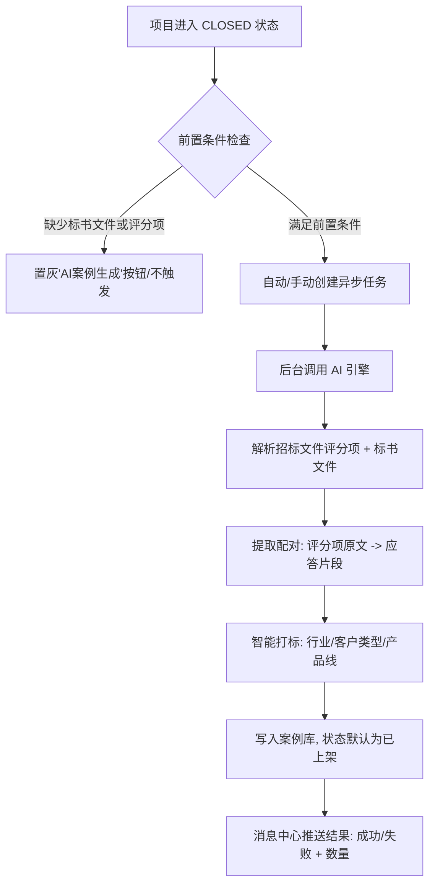
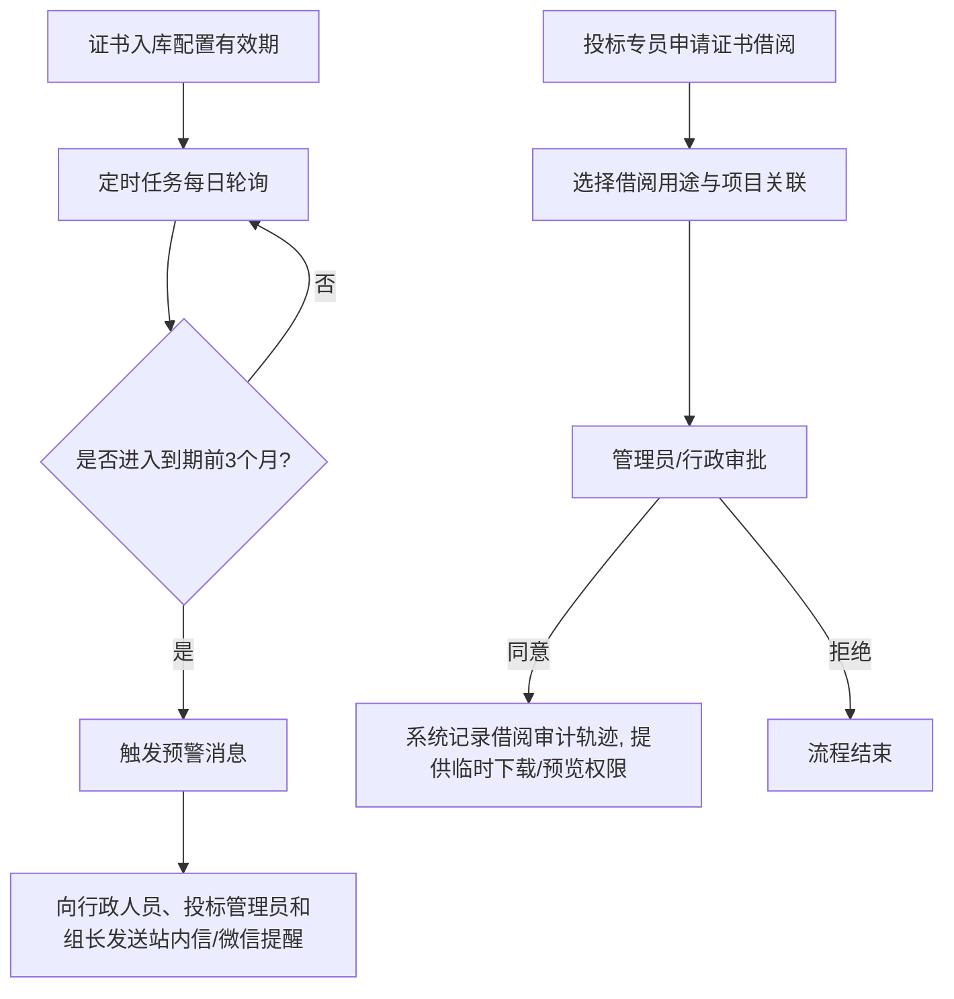

# 4.4 知识库产品需求文档 (PRD)

> **当前环境**：XiYu Bid POC / Codex Agent Worktree
> **协作模式**：真实 API 单一路径 (API-only)
> **验证基线**：VITE_API_MODE=api + 真实后端联调

---

## 1. 模块愿景与建设目标

知识库是西域数智化投标管理平台的重要知识沉淀与复用枢纽。通过对投标全生命周期的文档、企业资质、人员简历、历史业绩、品牌授权以及招标账号等资产进行数字化、智能化的集中管控，实现**“一次投标，永久沉淀，智能复用”**。

### 核心建设目标
- **方案管理（项目档案 & 案例库）**：实现项目全周期过程文档的自动即时归档，并通过 AI 进行标书优质应答段落的智能提取、打标、清洗与配对，支持一键复用。
- **资质证书管理**：解决公司级资质、证书分散管理问题，提供到期自动预警、借阅审计，并与 AI 招标文件解析实现“所需资质-证书库”自动匹配。
- **其他资产要素（人员简历、业绩管理、品牌授权、仓库信息）**：建立全方位的投标支撑台账，提高标书商务和技术响应编制的效率。

---

## 2. 角色与权限矩阵

知识库包含多项高敏感度的商务及技术资产，系统必须实施严格的数据与功能权限控制。以下为各子模块的权限划分：

| 模块/功能操作 | 投标管理员 | 投标组长 | 投标专员 | 项目负责人 | 跨部门协同 | 行政人员 |
|:---|:---:|:---:|:---:|:---:|:---:|:---:|
| **项目档案 Tab** | | | | | | |
| 查看/筛选/检索 | ✅ 全部项目 | ✅ 全部项目 | ✅ 仅参与的 | ❌ | ❌ | ❌ |
| 台账导出 (Excel) | ✅ | ✅ | ✅ 仅参与的 | ❌ | ❌ | ❌ |
| 文件包导出 (ZIP) | ✅ | ✅ | ✅ 仅参与的 | ❌ | ❌ | ❌ |
| 单个文件下载/预览 | ✅ | ✅ | ✅ 仅参与的 | ❌ | ❌ | ❌ |
| **案例库 Tab** | | | | | | |
| 案例查看/检索/复用 | ✅ 全部案例 | ✅ 全部案例 | ✅ 全部案例 | ❌ | ❌ | ❌ |
| 案例编辑/置顶/优质标记 | ✅ | ✅ | ❌ | ❌ | ❌ | ❌ |
| 案例上架/下架/删除 | ✅ | ✅ | ❌ | ❌ | ❌ | ❌ |
| **资质证书** | | | | | | |
| 查看/下载/预览/日志/导出 | ✅ | ✅ | ✅ | ❌ | ❌ | ✅ |
| 新增/编辑/下架/恢复/附件管理 | ✅ | ✅ | ❌ | ❌ | ❌ | ✅ |
| 配置全局告警规则 | ✅ | ❌ | ❌ | ❌ | ❌ | ❌ |
| **人员简历 / 业绩 / 授权** | | | | | | |
| 查看/检索/导出 | ✅ | ✅ | ✅ | ✅ | ❌ | ❌ |
| 增删改/归档管理 | ✅ | ✅ | ❌ | ❌ | ❌ | ❌ |

---

## 3. 业务流程与状态流转

### 3.1 AI 案例沉淀与复用流程

### 3.2 证书有效期提醒与借阅审批流

---

## 4. 方案管理详细规格

方案管理分为“项目档案”与“案例库”两个独立标签页（Tab）。

### 4.1 项目档案 Tab

#### 4.1.1 归档机制
- **归档时机**：即时归档。在投标项目全周期中，一旦处理人上传了文件，系统会立即在后台对文件归档入库，而不延迟到项目结项。
- **归档动作**：系统自动根据文件上传的入口位置与阶段，为文件打上对应的“文档分类”标签（如招标文件、标书文件、过程文件等）。
- **归档内容说明**：
  - **基础信息**（来自项目实体）：项目名称、招标主体、项目类型、项目状态、中标结果、项目负责人、投标负责人、立项日期、标书提交日期、开标日期、结项日期。
  - **过程信息**：归档文件总数、归档文件明细（包括文件名、大小、分类、上传人、上传时间）。

#### 4.1.2 档案台账界面规范
- **布局**：项目级列表（一行对应一个项目），顶部为搜索与筛选区。
- **筛选维度**：
  - 项目名称（模糊搜索）
  - 文档分类（多选下拉）
  - 项目负责人/投标负责人（下拉单选人员）
  - 时间范围（双轴日期：上传时间、结项时间，两轴相互独立）
  - 项目状态（多选）
  - 项目类型（工业电商/办公/综合/集采/其他）
- **列表显示字段**：
  1. 项目名称（超长省略，悬浮 Tooltip，点击跳转详情）
  2. 项目类型
  3. 项目状态（对应的标签颜色）
  4. 中标结果（中标-Success绿，未中标-Danger红，流标-Info灰）
  5. 归档文件数（列表显示总数，鼠标悬停 0.5s 后弹出 Popover 气泡显示各分类文件明细，如“招标文件: 3, 标书文件: 5”）
  6. 归档时间（该项目下最近一次文件的上传时间）
  7. 项目负责人
  8. 投标负责人
  9. 操作列：[查看]（点击滑出抽屉）、[下载]（打包下载该项目的所有归档文件）
- **操作逻辑**：双击列表行或点击“查看”按钮，右侧滑出抽屉展示详情。

#### 4.1.3 档案详情抽屉 (Drawer)
- **规格**：右侧抽屉，固定宽度 60% 屏幕（约 900px），支持半透明遮罩关闭。
- **页面布局（自上而下，纯只读无编辑）**：
  1. **基本信息区**：展示项目的 11 个基本信息字段。
  2. **文件清单区**：
     - 顶部展示文件总数和 `[下载文件包]` 按钮。
     - 列表展示：文件名、上传人、上传时间、文件大小。
     - 文件右侧提供 `[预览]`（仅支持 PDF 预览）和 `[下载]`（单文件下载）操作。按上传时间倒序排列。
  3. **操作日志区**：时间轴倒序，精确记录文件的预览、下载、台账导出行为。日志包含：操作时间、操作人、操作类型、具体描述（如“张三下载了合同文件_V1.pdf”）。

#### 4.1.4 档案导出规范
- **📊 导出台账 (Excel)**：
  - Sheet 1：项目基本信息。
  - Sheet 2：文件清单明细。
  - 命名格式：`方案管理-项目档案台账-YYYYMMDDHHmm.xlsx`。
- **📦 导出文件包 (ZIP)**：
  - 导出该筛选范围内所有项目的文件。
  - 压缩包内部结构：`[项目名]/[文档分类]/原文件名`。
  - 压缩包根目录下附带 `_台账.xlsx` 说明文档。
  - 命名格式：`方案管理-项目档案文件包-YYYYMMDDHHmm.zip`。

---

### 4.2 案例库 Tab

#### 4.2.1 AI 案例沉淀机制
- **触发条件**：项目状态变为 `CLOSED`（结项阶段），系统自动异步触发；或管理员在项目结项页手动点击 `[AI 自动生成案例]`。
- **前置校验**：项目下必须存在至少一份“标书文件”分类文件，且项目下至少包含一个评分项。否则按钮置灰。
- **处理步骤（异步）**：
  1. 读取标书文件与招标文件中的评分项。
  2. AI 识别评分项要求，在标书文件中寻找对应的应答内容片段，进行“只提取不改写”的切片。
  3. AI 对该应答片段进行智能打标（提取行业、客户类型、产品线等标签）。
  4. 写入案例表（存入字段：评分项原文、应答片段、源项目、中标结果、行业、客户类型等）。
  5. 任务结束后向触发者推送消息通知（成功/失败、入库数量、跳转链接）。

#### 4.2.2 案例卡片与检索规范
- **布局**：平铺的卡片网格。
- **排序规则**：支持按“最新”（生成时间倒序）、“最热”（按复用次数倒序）切换。
- **卡片展示内容**：
  - **顶部**：评分项精简标题（AI 从原文提炼或人工编辑）。
  - **中部**：应答内容摘要（前 80 字，超长省略号截断）；下方并排展示项目类型、客户类型标签。
  - **底部**：全局累计复用次数、生成时间。
  - **操作**：单按钮 `[📋 复用]`。
- **卡片交互**：
  - 点击卡片主体（排除复用按钮）滑出案例详情抽屉。
  - 点击 `[📋 复用]`：**仅复制应答片段原文**（无评分项、无项目来源）到剪贴板，不弹窗、不刷新，弹出 Toast 提示“已复制到剪贴板”，该案例复用计数 `reuseCount + 1`。

#### 4.2.3 案例详情抽屉
- **规格**：右侧滑出抽屉，固定宽度 560px。
- **核心区块（自上而下）**：
  1. **评分项原文**：展示完整招标要求段落，浅灰色等宽背景，超过 6 行展示滚动条。
  2. **应答片段全文**：展示 AI 抽取的应答内容，带总字数提示。最大高度 240px，超出可滚动。
  3. **案例元信息**：双列网格布局，展示来源项目（点击可跳转项目档案）、中标结果、项目类型、客户类型、复用次数、创建时间。
  4. **相似案例**：默认展示 3~5 条相关案例，展示评分项标题与复用次数。点击可直接在当前抽屉替换内容（无滑入动画）。
  5. **复用记录**：时间轴形式展示最近 3 条复用记录（时间 + 使用项目 + 使用人），支持点击 `[查看更多]` 展开全部。
- **底部操作栏**：
  - `[📋 复用]`：复制应答内容到剪贴板。
  - `[→ 查看源项目]`：跳转到该项目档案的抽屉详情。
  - `[📖 打开标书原文]`：下载源标书原始文件（Word/PDF）到本地。

#### 4.2.4 编标协同中的“AI 智能推荐”
- **入口位置**：投标项目 → 标书编制阶段的工作页顶部工具栏。
- **展现形式**：点击 `[🤖 AI 智能推荐]`，右侧展开抽屉。
- **交互逻辑**：
  - 抽屉顶部下拉框默认选中当前正在编制的评分项，支持切换。
  - 抽屉主体拉取案例库中与该评分项高度匹配的历史案例，呈卡片平铺。
  - 执行人可通过 `[📋 复用]` 快速复制，粘贴到本地 Word 编制中。

---

## 5. 资质证书管理规格

资质证书是公司投标的必要响应性材料。系统通过集中库、借阅审批流和到期提醒，保障资质的使用安全与合规。

### 5.1 数据结构与字段定义

| 字段名称 | 字段标识 | 类型 | 必填 | 校验 & 交互说明 |
|:---|:---|:---|:---:|:---|
| 证书名称 | name | 文本 | ✅ | 最大长度 200 字符。 |
| 等级 | level | 文本 | ✅ | 最大长度 50 字符。 |
| 认证机构 | authority | 文本 | ✅ | 最大长度 200 字符。 |
| 证书号/编码 | code | 文本 | ✅ | 最大长度 120 字符。系统级唯一，重复时保存提示“证书编号已存在”。 |
| 发证（备案）日期 | issueDate | 日期 | ✅ | 格式：YYYY-MM-DD。 |
| 证书有效期 | expiryDate | 日期 | ✅ | 格式：YYYY-MM-DD。必须晚于发证日期。 |
| 代理机构 | agency | 文本 | ✅ | 最大长度 200 字符。 |
| 代理联系方式 | contact | 文本 | ✅ | 手机号、固定电话或邮箱，需进行对应格式校验。 |
| 认证范围 | scope | 富文本 | ✅ | 最大长度 1000 字符，用于描述证书适用的产品或行业范围。 |
| 证书审核提醒 | alarmMemo | 文本 | ❌ | 最大长度 200 字符，备注到期提醒注意事项。 |
| 证书附件 | attachment | 附件 | ✅ | 单文件，仅限 PDF/JPG/PNG 格式，大小不超过 10MB。 |
| 证书状态 | status | 枚举 | ✅ | `ACTIVE`（在库）、`EXPIRED`（已过期）、`ARCHIVED`（下架）。 |

### 5.2 核心功能操作说明

#### 5.2.1 新增与 AI 辅助解析
- **新增入口**：列表页右上角 `[新增资质]` 按钮。
- **AI 识别**：新增弹窗中提供“资质文件 AI 识别上传区”。用户拖入证书扫描件后，系统调用 OCR + AI 解析，自动将证书名称、证书号、发证日期、有效期等回填至表单。用户核对无误后保存。

#### 5.2.2 编辑与附件更新
- 支持对已录入证书的字段及附件进行编辑更新。
- 每次附件变更必须重新写入审计日志，并记录变更人。

#### 5.2.3 下架与恢复
- **下架操作**：管理员/行政可对废弃、吊销的证书进行下架。下架后状态变更为 `ARCHIVED`，前台所有编标或推荐界面均不再展示。
- **恢复在库**：可在已下架列表中点击“恢复”，状态重回 `ACTIVE`。

#### 5.2.4 到期提醒规则
- **提醒时间**：证书有效期截止日前 **3个月** 自动触发告警。
- **提醒接收人**：行政人员、投标管理员、投标组长。
- **提醒方式**：系统内站内信高亮展示 + 企业微信应用消息推送。

#### 5.2.5 资质与招标文件的 AI 匹配（投标支撑）
- 在项目立项阶段，AI 解析招标文件生成“所需资质清单”后，会自动关联匹配资质证书库。
- 如果资质库中缺失所需资质，或匹配的证书处于“已过期”、“下架”或“到期前1个月”状态，系统会在立项风险评估中给出红色/黄色风险警示，防范废标风险。

---

## 6. 其他知识要素规格

### 6.1 人员简历 (Resumes)
- **定位**：投标团队成员的个人资历、专业证书（如一/二级建造师、PMP等）及历史参投业绩的结构化归档，以便在商务标书编制时一键生成人员资质附表。
- **核心字段**：姓名、工号、所属部门、学历、技术职称、所持执业证书及到期日、参投项目数、项目成功业绩摘要。
- **附件管理**：支持上传身份证件、毕业证、执业资格证书扫描件。
- **到期提醒**：执业证书到期前 2 个月向个人及管理员发送续期提醒。

### 6.2 业绩管理 (Performance)
- **定位**：用于沉淀西域历史中标项目及合同信息的台账。在商务标中，需频繁提供“类似项目业绩证明”，业绩管理可实现一键筛选与文件提取。
- **核心字段**：项目名称、招标主体、合同金额、签订日期、所属行业、项目经理、中标通知书附件、合同扫描件。
- **一键引用**：支持在项目标书编制阶段，通过项目类型和金额筛选相似业绩，并一键复制业绩描述或打包下载中标凭证与合同脱敏件。

### 6.3 品牌授权 (Brand Authorizations)
- **定位**：管理上游供应商给予西域的品牌代理授权书、原厂证明等。
- **核心字段**：授权品牌、授权供应商名称、授权范围（全国/省域/行业）、授权开始日期、授权截止日期、授权书扫描件。
- **到期预警**：授权截止日前 1 个月，系统触发预警，提醒项目组跟进原厂续签。

### 6.4 仓库信息（招标账号与数字证书 - BAR）
- **定位**：集中登记公司在各个政府/企采招投标平台的注册账号、密码及绑定的实体 Ukey（数字证书）硬件。
- **安全管控**：密码输入框默认掩码展示，获取需进行安全审计。
- **Ukey 借阅**：实行“借还登记簿”机制。专员投标需借用 Ukey 时需关联项目发起线上申请，系统记录 Ukey 领用人、归还状态、使用轨迹。

---

## 7. 非功能性需求与异常处理

### 7.1 非功能性指标
- **查询检索性能**：案例库全文检索（匹配分词与标签）响应时间应在 **2s** 以内。
- **AI 异步切片性能**：项目结项触发的 AI 案例沉淀后台处理时间限制在单标书（≤100页）在 **60s** 内完成切片。
- **大文件下载稳定性**：档案包打包下载（ZIP）支持断点续传，压缩和传输限流保障服务器带宽。

### 7.2 异常与边界处理
- **AI 案例切片失败**：若因标书文件损坏、格式不支持或评分项为空导致切片任务失败，任务状态变为“失败”，并在消息中心发送失败原因，支持管理员在档案详情页手动发起“重新触发 AI 沉淀”。
- **证书冲突**：人工录入或 AI 识别证书时，若证书号在系统数据库已存在（即使处于已下架状态），保存时进行拦截阻断，并提示：“该证书编号已登记在库中（持有者：{录入人}），请检查是否重复录入”。
- **文件包打包超限**：项目归档文件总大小超过 1GB 时，点击 `[导出文件包]` 需提示“文件体积过大，请在档案详情中分批次下载单文件，或联系系统管理员打包导出”。
