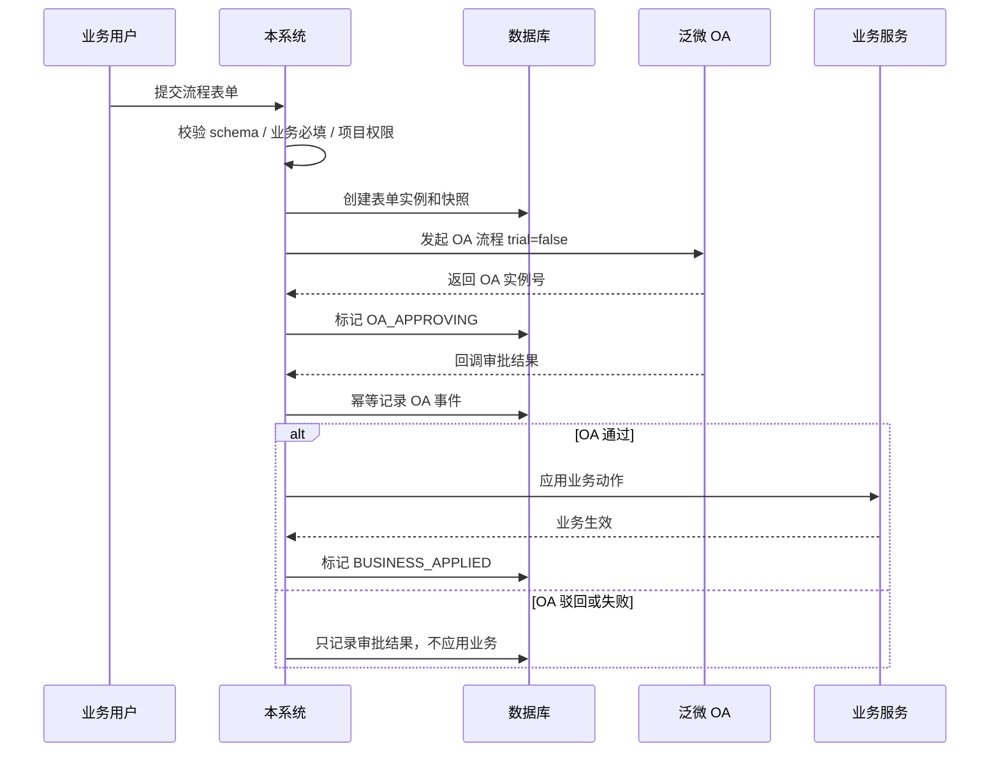

一旦我所属的文件夹有所变化，请更新我。

# 流程表单中心与泛微 OA 集成说明

## 定位

流程表单中心是西域数智化投标管理平台的“表单配置 + OA 触发 + 审批结果回收”底座。它解决的是客户需要类似 OA 的复杂表单，但审批事实源仍在泛微 OA 的场景。

第一版边界很明确：

- 本系统负责表单模板、字段 schema、版本发布、表单实例快照、OA 流程触发、OA 回调结果和业务生效状态。
- 泛微 OA 负责实际审批流、审批人、审批节点和审批结论。
- 本系统不实现本地审批流，不把 OA 审批规则塞进资质、合同、费用等业务模块。

## 用户入口

| 用户 | 入口 | 行为 |
|---|---|---|
| 管理员 | 系统设置 -> 流程表单配置 | 新建模板、配置字段、绑定 OA 流程、预览、试提交、发布 |
| 业务用户 | 资质借阅等业务入口 | 按已发布模板填写表单并提交 OA |
| OA 系统 | `/api/integrations/oa/weaver/callback` | 回传审批通过、驳回、失败等结果 |

## 管理员配置流程

1. 新建表单模板，填写模板编码、表单名称、业务类型和启用状态。
2. 在字段配置器中维护字段：文本、多行文本、数字、日期、下拉、人员、项目、附件、说明文本。
3. 配置泛微 OA 流程编码 `workflowCode`。
4. 生成或调整字段映射，将本系统字段映射到 OA 主表字段。
5. 预览表单，确认业务用户看到的 schema 渲染效果。
6. 试提交，进入 OA Gateway 的测试模式，返回测试 OA 实例号和 payload。
7. 发布模板，生成正式版本；后续业务提交只使用发布版。

## 发布与快照机制

模板有三类数据：

| 数据 | 表 | 说明 |
|---|---|---|
| 草稿 | `workflow_form_template_drafts` | 管理员编辑中的模板 |
| 历史版本 | `workflow_form_template_versions` | 每次发布生成一条不可变版本记录 |
| 运行态投影 | `workflow_form_templates` | 当前已发布版本，供业务提交读取 |

表单实例提交时会保存当时的：

- `template_version`
- `schema_snapshot_json`
- `oa_binding_snapshot_json`
- `oa_payload_json`

因此管理员后续修改模板、字段或 OA 映射，不会影响已经提交到 OA 的历史表单实例。

## 正式提交流程



资质借阅是第一条落地业务链路：提交后状态为 `OA_APPROVING`，资质不会立即借出；只有 OA 回调为 `APPROVED` 且业务应用成功后，才真正创建借阅记录。

## API 口径

### 管理端

| Method | Path | 用途 |
|---|---|---|
| `GET` | `/api/admin/workflow-forms/business-types` | 获取可配置业务类型 |
| `GET` | `/api/admin/workflow-forms/templates` | 获取模板草稿列表，包含已保存 OA 绑定 |
| `POST` | `/api/admin/workflow-forms/templates` | 创建模板草稿 |
| `PUT` | `/api/admin/workflow-forms/templates/{templateCode}/draft` | 更新模板草稿 |
| `PUT` | `/api/admin/workflow-forms/templates/{templateCode}/oa-binding` | 保存 OA 流程绑定和字段映射 |
| `POST` | `/api/admin/workflow-forms/templates/{templateCode}/oa/test-submit` | 试提交到 OA 测试通道 |
| `POST` | `/api/admin/workflow-forms/templates/{templateCode}/publish` | 发布模板版本 |

### 运行态

| Method | Path | 用途 |
|---|---|---|
| `GET` | `/api/workflow-forms/templates/{templateCode}/active` | 获取当前发布版 schema |
| `POST` | `/api/workflow-forms/instances` | 提交表单并触发 OA |
| `GET` | `/api/workflow-forms/instances/{id}` | 查看实例状态 |
| `POST` | `/api/integrations/oa/weaver/callback` | 泛微 OA 回调入口 |

## 字段 schema 示例

```json
{
  "fields": [
    {
      "key": "title",
      "label": "申请标题",
      "type": "text",
      "required": true
    },
    {
      "key": "expectedReturnDate",
      "label": "预计归还日期",
      "type": "date",
      "required": true
    },
    {
      "key": "projectId",
      "label": "项目",
      "type": "project",
      "required": true
    }
  ]
}
```

## OA 字段映射示例

```json
{
  "workflowCode": "WF_QUALIFICATION_BORROW",
  "mainFields": [
    {
      "source": "formData.title",
      "target": "field_title",
      "targetName": "申请标题",
      "type": "string",
      "required": true
    },
    {
      "source": "context.formInstanceId",
      "target": "field_external_id",
      "targetName": "本系统表单实例 ID",
      "type": "string",
      "required": true
    },
    {
      "source": "applicant.name",
      "target": "field_applicant",
      "targetName": "申请人",
      "type": "string",
      "required": true
    }
  ]
}
```

`source` 只允许安全前缀：

- `formData.*`
- `context.*`
- `applicant.*`

## 架构边界

| 层 | 位置 | 职责 |
|---|---|---|
| 纯核心 | `backend/src/main/java/com/xiyu/bid/workflowform/domain` | schema 校验、字段类型、OA 映射、payload 构造、状态流转、OA 结果应用策略 |
| 应用编排 | `backend/src/main/java/com/xiyu/bid/workflowform/application` | 保存草稿、发布模板、提交实例、触发 OA、处理回调、调用业务端口 |
| 副作用 | `backend/src/main/java/com/xiyu/bid/workflowform/infrastructure` | JPA、OA Gateway、项目权限守卫、资质借阅适配 |
| HTTP 边界 | `backend/src/main/java/com/xiyu/bid/workflowform/controller` | REST API 和回调入口 |
| 前端配置页 | `src/views/System/WorkflowFormDesigner.vue` | 页面编排、预览、试提交、保存、发布 |
| 前端 API | `src/api/modules/workflowForm.js` | 流程表单唯一真实 API 入口 |

符合 FP-Java Profile：业务规则留在纯核心，Application Service 只编排；Controller、Repository、Gateway 不承载规则计算。

## 安全与幂等

- 管理端接口需要 `ADMIN`。
- 业务提交接口需要登录用户具备对应项目访问权。
- OA 回调路径由 `OaCallbackVerifier` 做 secret、时间窗和签名校验。
- OA 回调事件以 `eventId` 去重。
- OA 通过使用状态条件更新，只有从 `OA_APPROVING` 成功切换到 `OA_APPROVED` 的事务才能应用业务动作。
- OA 驳回不创建业务记录。
- OA 已通过但业务应用失败时保留失败原因，后续需要管理员补偿重试台处理。

## 已知后续能力

这些事项已进入 `TODO.md`：

- 历史版本查看、差异对比、回滚发布。
- 附件字段真实上传、回显、实例快照和 OA 映射提交。
- 配置审计日志。
- OA 字段映射发布前校验。
- 模板权限与适用范围。
- 表单实例运维重试台。
- 端到端回归用例。

## 验证命令

```bash
mvn -f backend/pom.xml test '-Dtest=WorkflowForm*Test,WorkflowFormAdminControllerTest,ProjectMemberControllerTest'
mvn -f backend/pom.xml test '-Dtest=FPJavaArchitectureTest,MaintainabilityArchitectureTest,ProjectAccessGuardCoverageTest'
npx vitest run src/api/modules/workflowForm.spec.js src/views/System/workflow-form-designer/workflowFormDesignerCore.spec.js src/components/common/DynamicWorkflowForm.spec.js src/config/sidebar-menu.spec.js
npm run check:front-data-boundaries
npm run check:doc-governance
npm run check:line-budgets
npm run build
```
