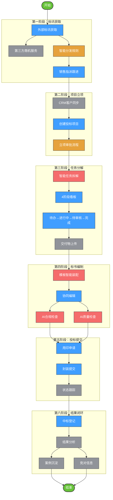
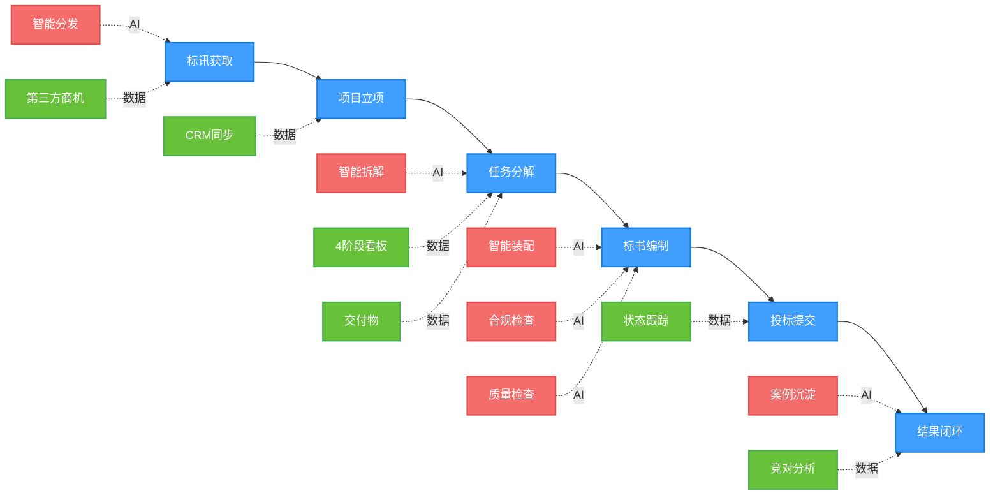
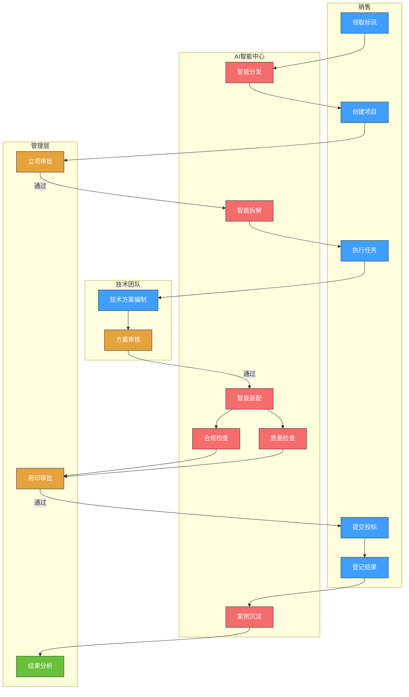

# 西域智慧供应链投标管理平台
## 业务流程全景图

---

## 方案一：泳道流程图（Mermaid）



---

## 方案二：水平流程图（Mermaid）

```mermaid
flowchart LR
    %% 定义样式
    classDef phase fill:#ecf5ff,stroke:#409EFF,stroke-width:2px
    classDef process fill:#ffffff,stroke:#409EFF,stroke-width:1px
    classDef ai fill:#fff0f0,stroke:#F56C6C,stroke-width:1px
    classDef arrow fill:#409EFF,stroke:#409EFF

    %% 主流程
    subgraph P1 [ ]
        direction TB
        P1_1[标讯获取]:::phase
        P1_2[外部平台]:::process
        P1_3[第三方服务]:::process
        P1_4[智能分发]:::ai
    end

    subgraph P2 [ ]
        direction TB
        P2_1[项目立项]:::phase
        P2_2[CRM同步]:::process
        P2_3[立项审批]:::process
    end

    subgraph P3 [ ]
        direction TB
        P3_1[任务分解]:::phase
        P3_2[智能拆解]:::ai
        P3_3[4阶段看板]:::process
        P3_4[交付物]:::process
    end

    subgraph P4 [ ]
        direction TB
        P4_1[标书编制]:::phase
        P4_2[智能装配]:::ai
        P4_3[协同编辑]:::process
        P4_4[AI检查]:::ai
    end

    subgraph P5 [ ]
        direction TB
        P5_1[投标提交]:::phase
        P5_2[用印申请]:::process
        P5_3[状态跟踪]:::process
    end

    subgraph P6 [ ]
        direction TB
        P6_1[结果闭环]:::phase
        P6_2[中标登记]:::process
        P6_3[案例沉淀]:::process
        P6_4[竞对分析]:::process
    end

    %% 流程连接
    P1 --> P2
    P2 --> P3
    P3 --> P4
    P4 --> P5
    P5 --> P6
```



---

## 方案三：简化流程图（Mermaid）



---

## 方案四：ASCII艺术版（可直接复制到PPT）

```
┌─────────────────────────────────────────────────────────────────────────────┐
│                          西域智慧供应链投标管理平台                            │
│                               业务流程全景图                                 │
└─────────────────────────────────────────────────────────────────────────────┘

  ┌──────────────┐    ┌──────────────┐    ┌──────────────┐    ┌──────────────┐
  │  标讯获取     │───→│  项目立项     │───→│  任务分解     │───→│  标书编制     │
  │              │    │              │    │              │    │              │
  │ • 外部平台    │    │ • CRM客户同步 │    │ • 智能任务拆解│    │ • 模板智能装配│
  │ • 第三方服务  │    │ • 立项审批   │    │ • 4阶段看板  │    │ • 协同编辑    │
  │ • 🤖智能分发  │    │              │    │ • 交付物管理  │    │ • 🤖AI合规检查│
  └──────────────┘    └──────────────┘    └──────────────┘    │ • 🤖AI质量检查│
                                                           └──────────────┘
                                                                 │
                                                                 ↓
  ┌──────────────┐    ┌──────────────┐    ┌──────────────┐    ┌──────────────┐
  │  结果闭环     │←───│  投标提交     │←───│  标书编制     │←───│  投标提交     │
  │              │    │              │    │              │    │              │
  │ • 中标登记    │    │ • 用印申请   │    │ （续）        │    │ • 用印申请   │
  │ • 结果分析    │    │ • 封装提交   │    │ • 版本管理    │    │ • 封装提交   │
  │ • 🤖案例沉淀  │    │ • 状态跟踪   │    │ • 在线审批    │    │ • 状态跟踪   │
  │ • 竞对信息    │    │              │    │              │    │              │
  └──────────────┘    └──────────────┘    └──────────────┘    └──────────────┘

═══════════════════════════════════════════════════════════════════════════════

图例说明：
  🤖 = AI智能能力        ● = 数据能力        ───→ = 流程方向
```

---

## 方案五：分层流程图（带角色泳道）



---

## 方案六：简化的水平泳道图（适合PPT）

```
                      西域智慧供应链投标管理平台业务流程

┌────────────────────────────────────────────────────────────────────────────────┐
│                                  销售人员                                         │
├────────────────────────────────────────────────────────────────────────────────┤
│  领取标讯  →  创建项目  →  执行任务  →  提交投标  →  登记结果                       │
│     ↓         ↓          ↓          ↓          ↓                              │
└─────────────┼──────────┼──────────┼──────────┼──────────────────────────────┘
              │          │          │          │
┌─────────────┴──────────┴──────────┴──────────┴──────────────────────────────┐
│                                  AI智能中心                                  │
├────────────────────────────────────────────────────────────────────────────────┤
│  智能分发  →  智能拆解  →  智能装配  →  合规检查  →  质量检查  →  案例沉淀        │
└────────────────────────────────────────────────────────────────────────────────┘
              │          │          │
┌─────────────┴──────────┴──────────┴──────────────────────────────────────────┐
│                                  管理层                                     │
├────────────────────────────────────────────────────────────────────────────────┤
│           立项审批  ←────────→  用印审批  ←────────→  数据分析                   │
└────────────────────────────────────────────────────────────────────────────────┘
              │
┌─────────────┴────────────────────────────────────────────────────────────────┐
│                                  技术团队                                    │
├────────────────────────────────────────────────────────────────────────────────┤
│                        技术方案编制  →  方案审核                               │
└────────────────────────────────────────────────────────────────────────────────┘

═══════════════════════════════════════════════════════════════════════════════
  流程说明：
  1. 蓝色箭头表示主流程方向
  2. 红色表示AI智能能力介入
  3. 绿色表示数据沉淀与分析
```

---

## 使用说明

### Mermaid图表使用方法：
1. **Markdown编辑器**：直接复制代码块到支持Mermaid的编辑器（如Typora、Obsidian、VS Code）
2. **在线渲染**：访问 https://mermaid.live 粘贴代码渲染
3. **导出图片**：渲染后可导出为PNG/SVG格式
4. **PPT使用**：导出PNG后插入PPT

### 推荐方案：
- **讲标演示**：方案三（简化流程图）或方案六（ASCII版）
- **技术文档**：方案一（泳道流程图）或方案二（水平流程图）
- **详细说明**：方案五（带角色泳道）
